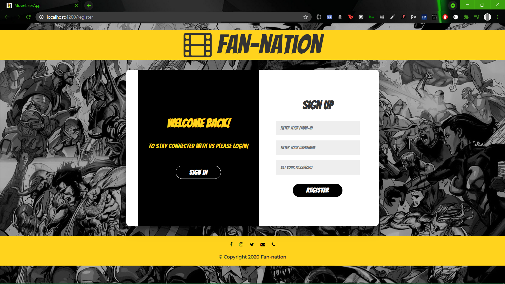
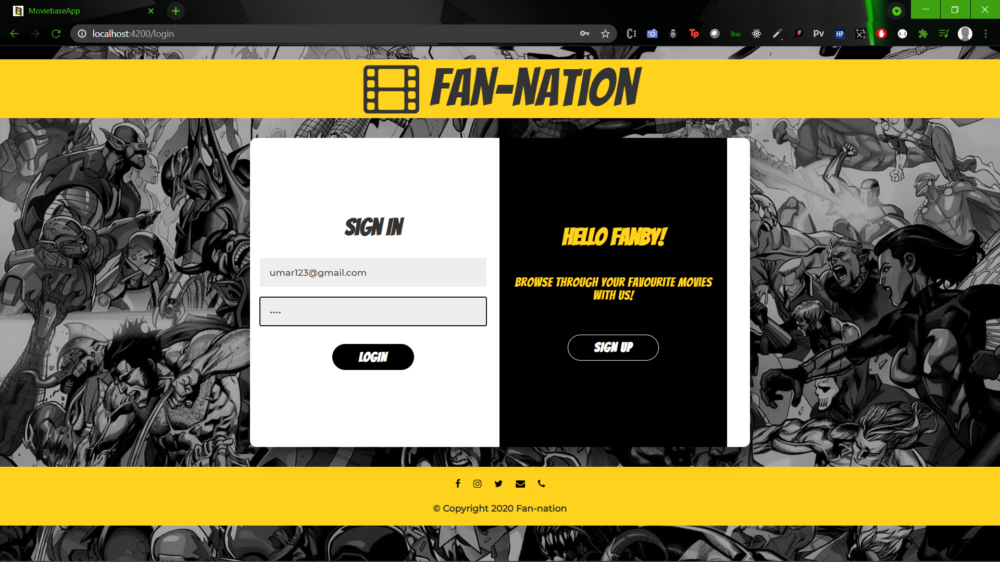
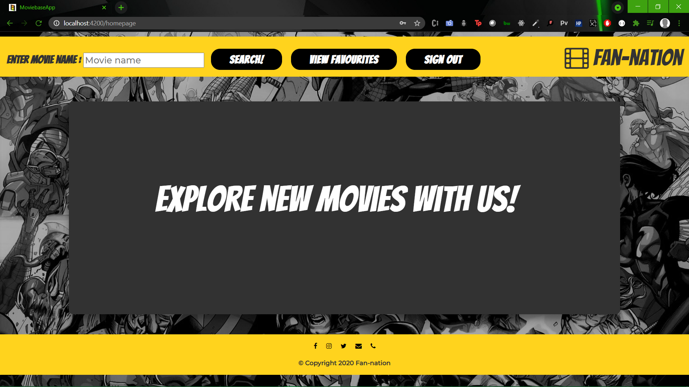
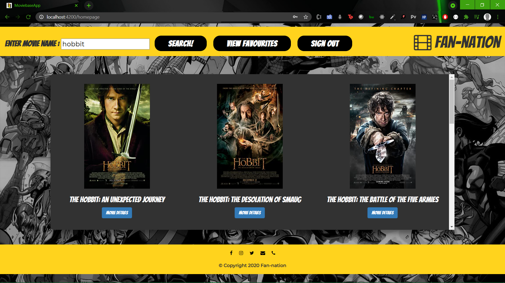
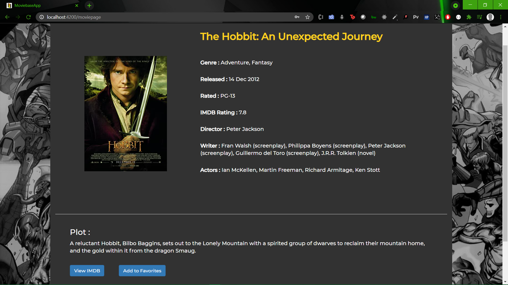
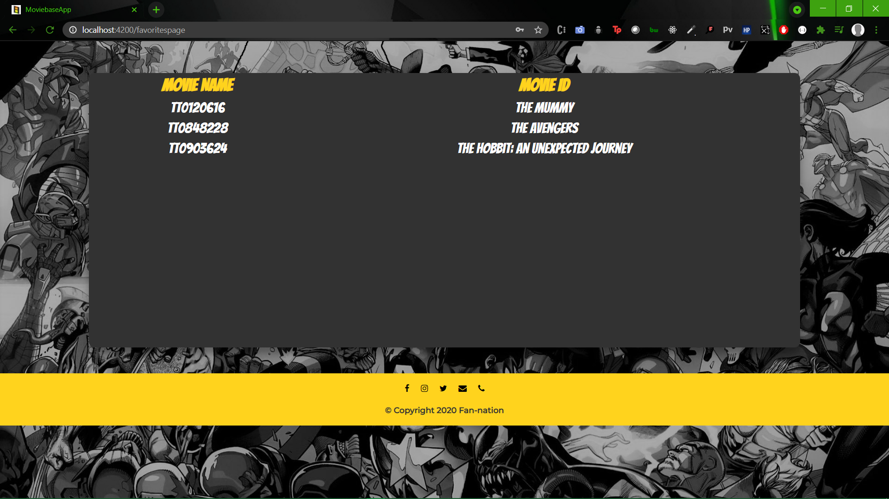

# MoviebaseApp

This project was generated with [Angular CLI](https://github.com/angular/angular-cli) version 11.2.11.

***

## Angular

### Development server

Run `ng serve` for a dev server. Navigate to `http://localhost:4200/`. The app will automatically reload if you change any of the source files.

### Code scaffolding

Run `ng generate component component-name` to generate a new component. You can also use `ng generate directive|pipe|service|class|guard|interface|enum|module`.

### Build

Run `ng build` to build the project. The build artifacts will be stored in the `dist/` directory. Use the `--prod` flag for a production build.

### Running unit tests

Run `ng test` to execute the unit tests via [Karma](https://karma-runner.github.io).

### Running end-to-end tests

Run `ng e2e` to execute the end-to-end tests via [Protractor](http://www.protractortest.org/).

### Further help

To get more help on the Angular CLI use `ng help` or go check out the [Angular CLI Overview and Command Reference](https://angular.io/cli) page.

***

## Procedure to run

### Install Packages

- **Bootstrap3**

        npm i --save bootstrap3

- **Font Awesome**

        
        npm i --save font-awesome
        

### Dummy JSON Server for database

    npm install -g json-server

- **users.json**

        json-server --watch users.json --port 3000

- **favorites.json**

        json-server --watch favorites.json --port 3001

***

## Sample Credentials

- Email ID - **umar123@gmail.com**
- Password - **umar**

***

## Snapshots

***